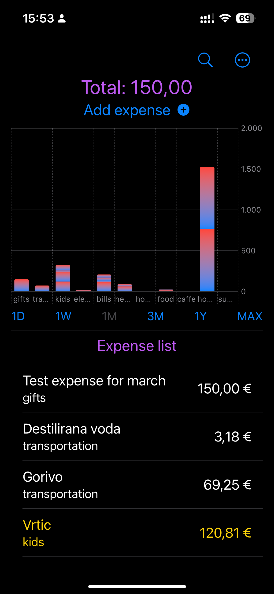
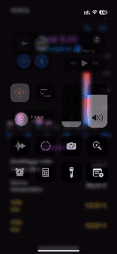
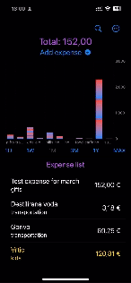
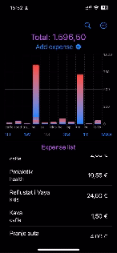
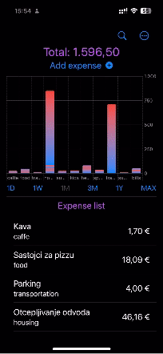
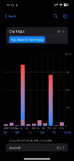
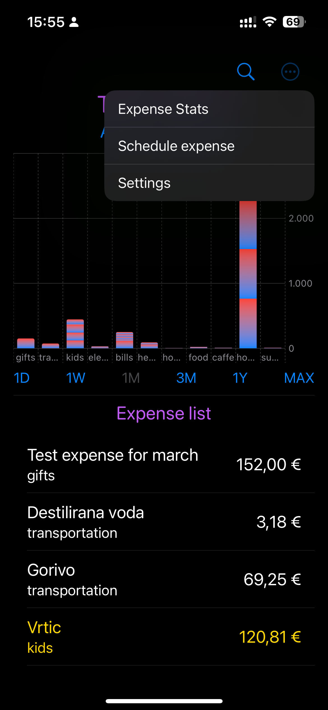
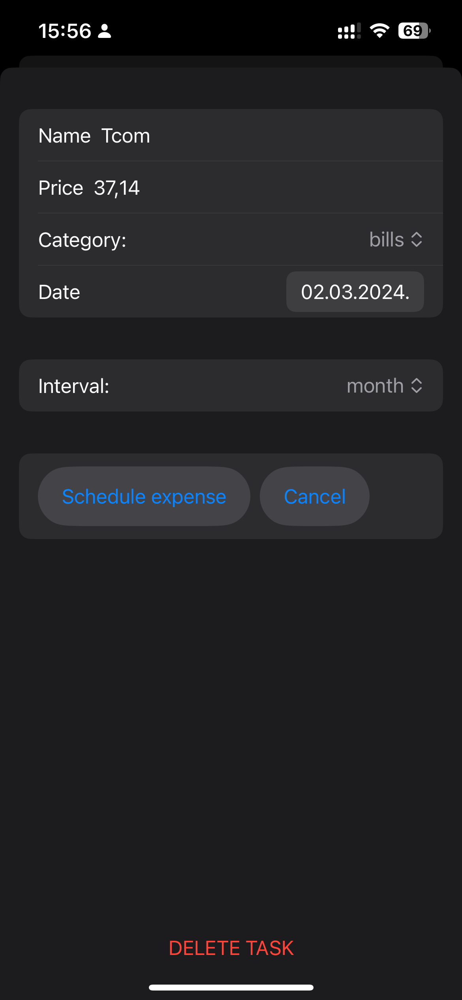

# ExpenseTracker
## _iOS and Flutter applicaions to track your expenses_

Expense tracker is iOS (SwiftUI) aplication that allows you to track your expenses and view different statistics.

## Features

- create, edit and delete expenses
- view statistics of your spending by category and time
- see different charts to better understand your expenses
- filter your expenses 

## Main screen
- magnyfing glass (navigate to search screen)
- taskbar menu (navigate to different screens)
- Total - total money spent this month
- create new expense button
- chart showing money spent per different category of expenses
- buttons to use data (expenses) from different time intervals to be  shown on the chart and in expense list bellow
- expense list shows expenses in created in time interval selected above. Taping on any of them presents edit/delete sheet
- expenses created automatically through scheduling mechainsm are marked yellow in expense list

### Main screen (create expense)
- Total spent this month is zero at the beginning since all the expenses are from previous month
- after expense is created list of expenses is updated, chart is updated, total spent this month is updated
- taping on any expense shows menu in which you can edit or delete the expense

### Schedule expense
- expenses can be scheduled to be executed in regular intervals (like bills, morgage etc)
- scheduled expense in this example has been set to execute today so it is execudet imidietly (total money spent this month updated, graph updated, list of expenses updated)
- scheduled expenses that have been executed are marked yellow in list of expenses
- taping on any scheduled expense shows menu in which you can edit or delete the scheduled expense

### Search expense (filter by different parameters)
- in order to access search menu tap on magnifying glass in task bar
- as user changes search parameters list of expenses is automatically updated
- taping on any of the expenses presents to Edit/Delete expense sheet to user

### Change chart type shown on main screen
- user can change between bar and pie chart as a default chart on main screen
- no metter which type of chart is set to default user can still view all charts in expense stats menu

### See different expense statistics
- in expense stats screen user can see different charts that show different perspective of their expenses
- charts can be filtered by date
- user can see total spent per category in certain interval of time
- user can see avarage expenditure per category in certain interval of time

## Task bar menu
- navigate between different menus in the app

## Settings (factory reset the app - loose all the data)
- factory reset the application
- this deletes all the data from the app and you start from beginning

## Edit scheduled expense
- screen where user can edit or delete already created scheduled expense

